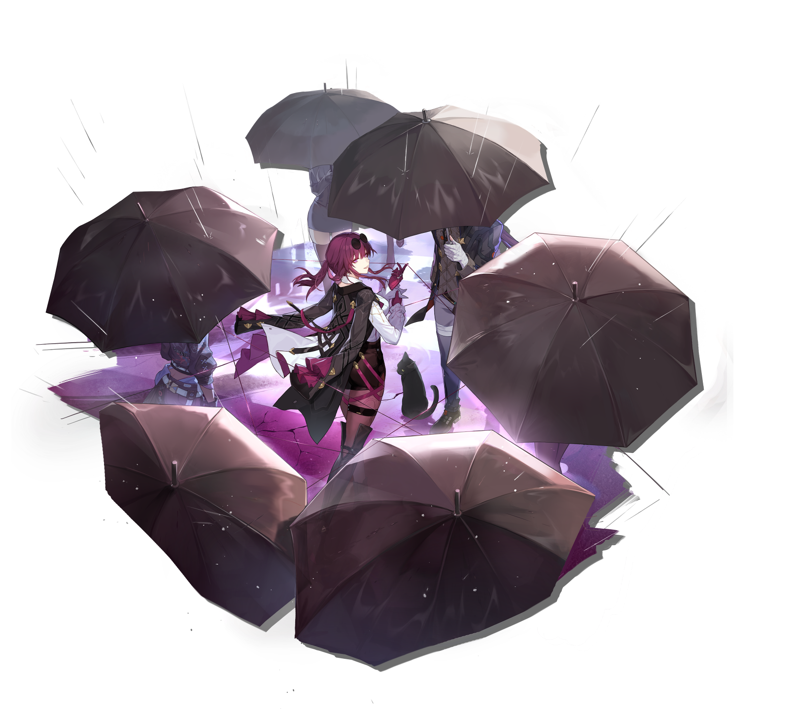

    <!-- 第一栏 -->
    

        
 <!-- 固定宽高比容器 -->
            
        

        
💗Kafka💗

    

    <!-- 第二栏 -->
    

        
 <!-- 固定相同宽高比 -->
            
        

        

            
Meet Me at Midnight

            
Swifties

        

    

