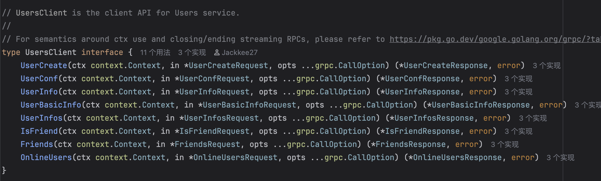
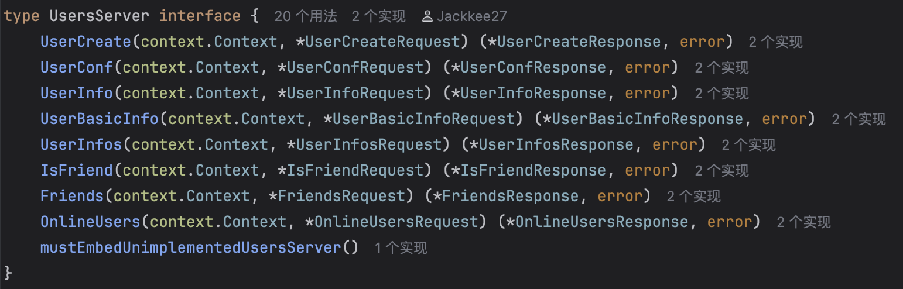

这篇文章介绍了关于在 gRPC 部分生成文件的解释。

<!--more-->

## `.pb.go`

### `{service_name}.pb.go`

用于填充、序列化和检索请求和响应消息类型的 `protobuf` 代码。

主要包括：

- Request 以及对应获取 Request 字段的 Get 方法。
- Response 以及对应获取 Response 字段的 Get 方法。
    - 使用 Get 方法，可以避免直接调用带来的潜在空指针错误。
- 序列化、检索这些响应和请求的方法。

 💡


以 users 服务的 `UserCreate` 方法为例，其生成的 `users.pb.go` 中包含以下和请求、响应有关的信息：

```go
type UserCreateRequest struct {
	state         protoimpl.MessageState
	sizeCache     protoimpl.SizeCache
	unknownFields protoimpl.UnknownFields

	OpenId         string `protobuf:"bytes,4,opt,name=open_id,json=openId,proto3" json:"open_id,omitempty"`
}

func (x *UserCreateRequest) Reset() {
	*x = UserCreateRequest{}
	mi := &file_user_proto_msgTypes[0]
	ms := protoimpl.X.MessageStateOf(protoimpl.Pointer(x))
	ms.StoreMessageInfo(mi)
}

func (x *UserCreateRequest) String() string {
	return protoimpl.X.MessageStringOf(x)
}

func (*UserCreateRequest) ProtoMessage() {}

func (x *UserCreateRequest) ProtoReflect() protoreflect.Message {
	mi := &file_user_proto_msgTypes[0]
	if x != nil {
		ms := protoimpl.X.MessageStateOf(protoimpl.Pointer(x))
		if ms.LoadMessageInfo() == nil {
			ms.StoreMessageInfo(mi)
		}
		return ms
	}
	return mi.MessageOf(x)
}

// Deprecated: Use UserCreateRequest.ProtoReflect.Descriptor instead.
func (*UserCreateRequest) Descriptor() ([]byte, []int) {
	return file_user_proto_rawDescGZIP(), []int{0}
}

func (x *UserCreateRequest) GetOpenId() string {
	if x != nil {
		return x.OpenId
	}
	return ""
}

type UserCreateResponse struct {
	state         protoimpl.MessageState
	sizeCache     protoimpl.SizeCache
	unknownFields protoimpl.UnknownFields

	UserId uint32 `protobuf:"varint,1,opt,name=user_id,json=userId,proto3" json:"user_id,omitempty"`
}

func (x *UserCreateResponse) Reset() {
	*x = UserCreateResponse{}
	mi := &file_user_proto_msgTypes[1]
	ms := protoimpl.X.MessageStateOf(protoimpl.Pointer(x))
	ms.StoreMessageInfo(mi)
}

func (x *UserCreateResponse) String() string {
	return protoimpl.X.MessageStringOf(x)
}

func (*UserCreateResponse) ProtoMessage() {}

func (x *UserCreateResponse) ProtoReflect() protoreflect.Message {
	mi := &file_user_proto_msgTypes[1]
	if x != nil {
		ms := protoimpl.X.MessageStateOf(protoimpl.Pointer(x))
		if ms.LoadMessageInfo() == nil {
			ms.StoreMessageInfo(mi)
		}
		return ms
	}
	return mi.MessageOf(x)
}

// Deprecated: Use UserCreateResponse.ProtoReflect.Descriptor instead.
func (*UserCreateResponse) Descriptor() ([]byte, []int) {
	return file_user_proto_rawDescGZIP(), []int{1}
}

func (x *UserCreateResponse) GetUserId() uint32 {
	if x != nil {
		return x.UserId
	}
	return 0
}
```



### `{service_name}_grpc.pb.go`

- 一个接口类型（或 stub），供 Client 端调用，其中包含在服务中定义的方法。

    - `{service_name}Client`

      

- 一个接口类型，供 Server 端实现，也包含在服务中定义的方法。

    - `{service_name}Server`

      